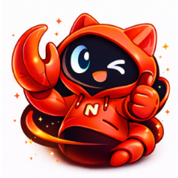
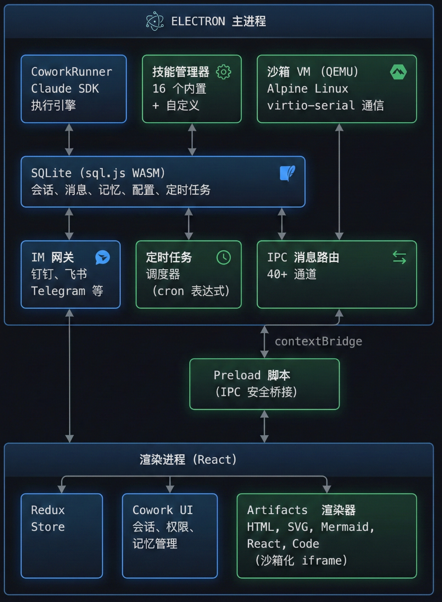

# NoobClaw — 全球首款 Web3 即插即用 AI 智能助手

<p align="center">
  
</p>

<p align="center">
  <strong>Web3 原生的 AI Agent —— 工作、赚币、连接去中心化世界。</strong>
</p>

<p align="center">
  <a href="LICENSE"></a>
  <br>
  
  <br>
  
  
</p>

<p align="center">
  <a href="README.md">English</a> · 中文
</p>

---

## NoobClaw 是什么？

**NoobClaw** 是由 [NoobClaw](https://www.noobclaw.com/) 打造的 Web3 原生 AI 助手。它是全球首款 Web3 即插即用 AI 智能助手，将自主 AI Agent 的能力与完整的 Web3 生态融为一体 —— 钱包认证、代币经济、加密市场追踪、去中心化身份 —— 全部集成在一个桌面应用中，更可以边玩边挖$NoobCoin。

告诉 NoobClaw 你需要什么 —— 分析数据、撰写报告、制作视频、搜索信息、收发邮件 —— 它就会自主完成。连接钱包即可使用内置 AI 服务，无需 API Key；通过使用和邀请好友赚取 NoobCoin；实时关注 Web3 新闻、KOL 动态、岗位信息和交易所资讯。

核心是 **Cowork 模式**：Agent 在本地或沙箱环境中执行工具、操作文件、运行命令，一切都在你的明确授权下进行。你掌控全局，NoobClaw 负责干活。

## 核心亮点

| | 特性 | 说明 |
|---|------|------|
| **Web3 钱包** | 钱包认证、BNB 支付、代币余额、订单管理 | 无需注册，连接钱包即用 |
| **NoobCoin 经济** | 使用赚币、邀请返利、空投奖励 | 越用越赚 |
| **Web3 信息中心** | 加密新闻、KOL 追踪、Web3 求职、交易所目录 | 一站掌握 Web3 动态 |
| **全能 AI Agent** | 数据分析、PPT、视频、文档、搜索、邮件 | 一个 Agent 搞定日常工作全流程 |
| **21 种内置技能** | Office 文档、Playwright 自动化、Remotion 视频、Canvas 设计、邮件、天气等 | 开箱即用，能力丰富 |
| **技能商店** | 浏览、安装、创建社区技能 | 能力无限扩展 |
| **免费使用AI** | 内置NoobClawAI 新用户赠送100万Token，其他功能和技能免费使用，亦支持OpenAI/DeepSeek等主流AI厂商 
| **本地 + 沙箱** | 本地直接运行或隔离的 Alpine Linux VM | 要速度有速度，要安全有安全 |
| **定时任务** | 对话式或 GUI 创建 Cron 定时任务 | 每日新闻、周报、邮箱整理——全自动 |
| **持久记忆** | 自动从对话中提取偏好和个人信息 | 越用越懂你 |
| **手机远程操控** | Telegram、Discord、钉钉、飞书 | Agent 装进口袋 |
| **MCP 集成** | 支持 stdio / SSE / HTTP 协议的 MCP 服务器 | 接入任意外部工具和数据源 |
| **权限门控** | 每一次敏感工具调用都需要你的批准 | 你始终掌控一切 |
| **全平台** | macOS（Intel + Apple Silicon）、Windows、Linux、IM 移动端 | 哪里都能用 |
| **数据本地化** | SQLite 本地存储 | 数据不离开你的设备 |

## 工作原理

<p align="center">
  
</p>

## Web3 功能

### 钱包与支付

NoobClaw 采用钱包认证 —— 不需要传统账号。连接你的 Web3 钱包即可解锁内置 AI 服务并管理代币。

- **钱包认证** — 连接 Web3 钱包即可登录，认证令牌和钱包地址本地存储
- **BNB 支付** — 用 BNB 购买 AI 使用额度，完整的订单生命周期管理（待支付 → 确认中 → 已完成）
- **代币余额** — 应用内实时余额显示与刷新
- **订单历史** — 完整的支付记录，支持筛选和搜索

### NoobCoin 代币经济

- **使用赚币** — 通过使用和互动积累 NoobCoin
- **邀请返利** — 邀请好友赚取额外代币奖励
- **空投领取** — 在应用内直接领取空投奖励
- **幸运红包** — 领取惊喜代币奖励

### Web3 信息中心

**热点** 视图和 **Web3 连接** 面板让你时刻掌握去中心化世界的脉搏：

- **加密行情** — BTC、ETH、SOL、BNB、AVAX、DOT、ADA、DOGE、XRP 实时价格图标
- **新闻动态** — 精选 Web3 新闻，支持分类筛选和分页浏览
- **KOL 追踪** — 关注加密领域关键意见领袖
- **Web3 求职** — 聚合 Web3.Career、CryptoJobs、DeJob 等平台岗位
- **交易所目录** — 浏览和访问各大加密货币交易所

### 活动与合作伙伴

专属视图展示 Web3 合作公告、社区活动和生态更新。

## 快速开始

### 环境要求

- **Node.js** >= 24 < 25
- **npm**

### 安装与开发

```bash
# 克隆仓库
git clone https://github.com/noobclaw-noobclaw/NoobClaw.git
cd noobclaw

# 安装依赖
npm install

# 启动开发环境（Vite 开发服务器 + Electron 热重载）
npm run electron:dev
```

开发服务器默认运行在 `http://localhost:5175`。

### 生产构建

```bash
# 编译 TypeScript + Vite 打包
npm run build

# ESLint 代码检查
npm run lint
```

## 打包分发

使用 [electron-builder](https://www.electron.build/) 生成各平台安装包，输出到 `release/` 目录。

```bash
# macOS
npm run dist:mac              # Universal .dmg（自动检测架构）
npm run dist:mac:x64          # 仅 Intel
npm run dist:mac:arm64        # 仅 Apple Silicon
npm run dist:mac:universal    # 双架构胖二进制

# Windows (.exe NSIS 安装包)
npm run dist:win

# Linux (.AppImage & .deb)
npm run dist:linux
```

**Windows Python 运行时** — Windows 打包会内置便携 Python 运行时到 `resources/python-win`，用户无需手动安装 Python。技能所需的 Python 依赖包在运行时按需安装。

<details>
<summary>离线 / CI 打包选项</summary>

- `NOOBCLAW_PORTABLE_PYTHON_ARCHIVE`：本地预构建运行时压缩包路径（离线 CI/CD 推荐）
- `NOOBCLAW_PORTABLE_PYTHON_URL`：预构建运行时压缩包下载地址
- `NOOBCLAW_WINDOWS_EMBED_PYTHON_VERSION` / `NOOBCLAW_WINDOWS_EMBED_PYTHON_URL` / `NOOBCLAW_WINDOWS_GET_PIP_URL`：Windows 主机构建时自动拉取源的可选覆盖项

</details>

## 支持的 AI 服务商

使用内置 **NoobClaw AI** 服务（钱包认证，无需 API Key）或接入你自己的：

| 服务商 | 代表模型 | API 格式 |
|--------|---------|----------|
| **NoobClaw AI**（默认） | GPT / Gemini / DeepSeek / Qwen / Minimax  | OpenAI |
| OpenAI | GPT-5.2, GPT-5.2 Codex | OpenAI |
| Anthropic | Claude Sonnet 4.5/4.6, Claude Opus 4.6 | Anthropic |
| DeepSeek | DeepSeek Chat, DeepSeek Reasoner | Anthropic |
| Moonshot（Kimi） | Kimi K2.5 | Anthropic |
| 通义千问（阿里） | Qwen 3.5 Plus, Qwen 3 Coder Plus | Anthropic |
| 智谱（GLM） | GLM 5, GLM 4.7 | Anthropic |
| Gemini | Gemini 3 Pro, Gemini 3.1 Pro, Gemini 3 Flash | OpenAI |
| Minimax | MiniMax M2.5, M2.1 | Anthropic |
| 自定义 | 任意 OpenAI 兼容接口 | 可配置 |

在 **设置** 中自由切换服务商和模型。

## 技能系统

内置 **21 种技能**，覆盖办公、创意、自动化等多种场景：

| 技能 | 功能 |
|------|------|
| 各大交易所Skill| Crypto交易 |
| web-search | 搜索互联网信息 |
| docx | 生成 Word 文档 |
| xlsx | 创建 Excel 表格 |
| pptx | 制作 PowerPoint 演示文稿 |
| pdf | 解析、转换、处理 PDF |
| remotion | 使用 Remotion 生成视频 |
| playwright | 使用 Playwright 自动化浏览器操作 |
| canvas-design | Canvas 绘图，设计海报和图表 |
| frontend-design | 前端 UI 原型设计 |
| develop-web-game | 快速 Web 游戏原型开发 |
| scheduled-task | 创建和管理定时任务 |
| create-plan | 项目规划与任务分解 |
| weather | 天气信息查询 |
| local-tools | 本地文件与系统操作 |
| imap-smtp-email | 通过 IMAP/SMTP 收发邮件 |
| seedream | AI 图片生成 |
| seedance | AI 视频生成 |
| films-search | 电影 / 剧集搜索 |
| music-search | 音乐搜索 |
| technology-news-search | 科技资讯聚合 |
| skill-creator | 创建自定义技能 |

**技能商店** — 从社区市场浏览和安装更多技能，也可以发布自己的技能。

## 定时任务

通过自然语言对话或 GUI 面板创建定时任务：

| 调度类型 | 示例 |
|---------|------|
| 定时 | 在指定日期/时间执行 |
| 间隔 | 每 30 分钟、每 2 小时 |
| Cron | `0 9 * * 1-5`（工作日早上 9 点） |

**典型场景：** 每日新闻收集、邮箱整理、周度业务报告、网站监控、工作提醒。

执行结果可在桌面端查看，也可通过已连接的 IM 平台推送到手机。

## IM 集成 — 手机端远程操控

将 Agent 桥接到你常用的 IM 平台。在手机上发一条消息，即可远程触发桌面端 Agent 执行任务。

| 平台 | 协议 |
|------|------|
| Telegram | grammY Bot API |
| Discord | discord.js |
| 钉钉 | DingTalk Stream |
| 飞书 | Lark SDK |

在设置面板中配置对应平台的 Token / 密钥即可启用。

## 持久记忆

NoobClaw 自动从对话中学习你的偏好，并跨会话记住。

- **自动提取** — 从自然对话中识别个人信息、偏好和事实
- **主动告知** — 说「记住我喜欢用 Markdown 格式」即可高置信度存储
- **手动管理** — 在记忆管理面板中添加、编辑或删除条目

| 设置项 | 默认值 |
|--------|--------|
| 记忆开关 | 开启 |
| 自动捕获 | 开启 |
| 捕获严格度 | 标准（严格 / 标准 / 宽松） |
| 最大注入条数 | 12（范围 1–60） |

## 架构概览

NoobClaw 采用 Electron 严格进程隔离架构，所有跨进程通信通过 IPC 完成。

```
Main Process (src/main/main.ts)
├── 窗口生命周期 & SQLite 数据持久化
├── CoworkRunner — Claude Agent SDK 执行引擎
├── OpenAI 兼容代理 — 多服务商 API 格式转换
├── IM 网关 — Telegram、Discord、钉钉、飞书
├── 调度器 — Cron 定时任务执行
├── 技能管理 & MCP 服务器管理
└── 安全：context isolation 开启，node integration 关闭，sandbox 开启

Preload Script (src/main/preload.ts)
└── contextBridge → window.electron API（cowork + electron 命名空间）

Renderer Process (src/renderer/)
├── React 18 + Redux Toolkit + Tailwind CSS
├── Web3 钱包认证 & 代币经济
├── 所有 UI 和业务逻辑
└── 仅通过 IPC 与主进程通信
```

### 目录结构

```
src/
├── main/                           # Electron 主进程
│   ├── main.ts                     # 入口，IPC 处理
│   ├── preload.ts                  # 安全桥接
│   ├── sqliteStore.ts              # SQLite 存储
│   ├── coworkStore.ts              # 会话/消息 CRUD
│   ├── skillManager.ts             # 技能管理
│   ├── im/                         # IM 网关
│   └── libs/
│       ├── coworkRunner.ts         # Agent SDK 执行器
│       ├── coworkVmRunner.ts       # 沙箱 VM 执行
│       ├── coworkSandboxRuntime.ts # 沙箱生命周期
│       ├── coworkOpenAICompatProxy.ts # 多服务商 API 代理
│       └── coworkMemoryExtractor.ts # 记忆提取
│
├── renderer/                        # React 前端
│   ├── App.tsx                     # 根组件
│   ├── types/                      # TypeScript 类型定义
│   ├── store/slices/               # Redux 状态切片
│   ├── services/
│   │   ├── noobclawAuth.ts        # 钱包认证
│   │   ├── noobclawApi.ts         # 后端 API（支付、代币、邀请返利）
│   │   └── ...                    # 其他服务
│   └── components/
│       ├── cowork/                 # Cowork UI
│       ├── wallet/                 # 钱包与支付 UI
│       ├── web3/                   # Web3 新闻、KOL、求职、交易所
│       ├── skills/                 # 技能管理 UI
│       ├── scheduledTasks/         # 定时任务 UI
│       ├── mcp/                    # MCP 配置 UI
│       ├── im/                     # IM 集成 UI
│       └── Settings.tsx            # 设置面板
│
SKILLs/                              # 技能定义目录
├── skills.config.json              # 技能启停与排序配置
└── ...                             # 21 种内置技能
```

## 安全机制

| 层级 | 机制 |
|------|------|
| 进程隔离 | context isolation 开启，node integration 关闭 |
| 权限门控 | 所有敏感工具调用需用户明确批准 |
| 沙箱执行 | 可选 Alpine Linux VM 隔离执行 |
| 内容安全 | HTML 沙箱、DOMPurify、Mermaid 严格模式 |
| 工作区边界 | 文件操作限制在指定工作目录内 |
| IPC 验证 | 所有跨进程调用经过类型检查与校验 |
| 钱包认证 | 去中心化身份，无需存储密码 |

## 技术栈

| 层 | 技术 |
|----|------|
| 框架 | Electron 40 |
| 前端 | React 18 + TypeScript 5 |
| 构建 | Vite 5 |
| 样式 | Tailwind CSS 3 |
| 状态 | Redux Toolkit |
| AI 引擎 | Claude Agent SDK (Anthropic) |
| 存储 | sql.js (SQLite) |
| Markdown | react-markdown + remark-gfm + rehype-katex |
| 图表 | Mermaid |
| 安全 | DOMPurify |
| IM | grammY · discord.js · dingtalk-stream · @larksuiteoapi/node-sdk |

## 开发规范

- TypeScript 严格模式，函数式组件 + Hooks
- 2 空格缩进，单引号，分号
- 组件 `PascalCase`，函数/变量 `camelCase`，Redux 切片 `*Slice.ts`
- Tailwind CSS 优先，避免自定义 CSS
- 提交格式：`type: imperative summary`（如 `feat: add artifact toolbar`）
- 语言：中文和英文以及多种小语种，通过设置面板切换

## 贡献

1. Fork 本仓库
2. 创建特性分支（`git checkout -b feature/your-feature`）
3. 提交改动（`git commit -m 'feat: add something'`）
4. 推送到远程（`git push origin feature/your-feature`）
5. 发起 Pull Request

PR 描述中请包含：变更说明、关联 issue、UI 变更附截图，以及涉及 Electron 特定行为的说明。

## 许可证

[MIT License](LICENSE)

## Star History

[](https://www.star-history.com/#noobclaw-noobclaw/NoobClaw&type=date&legend=top-left)

---

由 [NoobClaw](https://www.noobclaw.com/) 开发维护，作者:Taylor/Chris 基于OpenClaw/Lobsterai。
